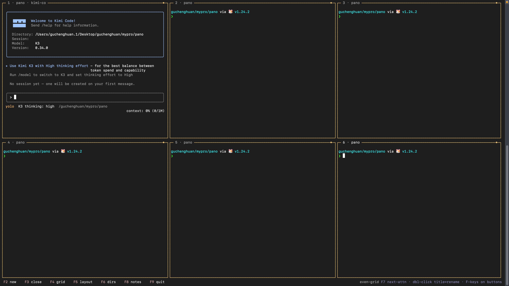
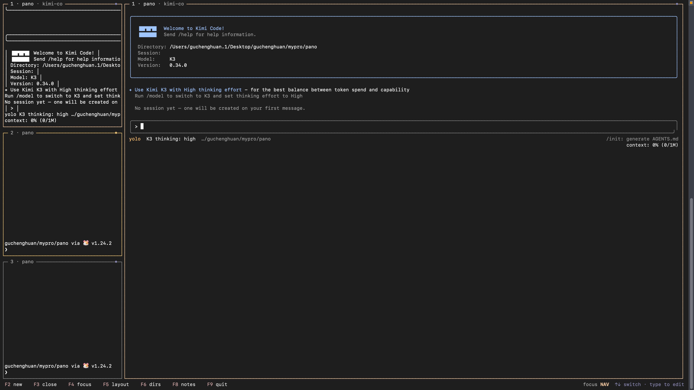

# Pano — 多终端 TUI 管理器

在一个终端窗口里**同屏运行多个真实 shell 终端**，无需切 tab；内置面向 AI coding agent（Claude Code / Codex / OpenCode / Gemini / Kimi Code 等）的**注意力感知**——哪个任务在跑、哪个在等你确认、哪个完成了，只需要扫一眼标题栏状态。

## 做pano的初衷

Pano 拒绝多Tab切换，一个屏幕可以观察N个任务状态：**同屏多真实终端 + 被动输出检测 + 主动 hook 上报（OSC / ctl 双通道）+ 会话可恢复**。

只需要专注在一个窗格干活，其余窗格的状态浓缩成标题栏上的一颗状态点；需要你介入时，一跳即达。

## 功能特性

- **同屏多终端**：基于二叉分屏树的窗口布局，拖拽任意边界只影响相邻两侧；增删窗格自动重建为均衡网格；

- **专注模式**：侧栏小窗格是所有终端的**实时 tail 预览** ——任务在跑看到输出滚动，跑完看到 `ok`/`FAIL`/提示符回来；主视图完整交互

- **注意力机制**：标题栏四色状态点（绿=有输出/agent 工作 · 黄=未读/agent 等确认 · 红=BEL/OSC 通知 · 灰=闲置），黄/红同步染边框；`F7` 循环跳到下一个待关注窗格
- **Agent 感知**：识别前台 agent 进程（进程树最深命中），对屏幕尾部做规则匹配；**blocked（等确认）规则永远压过 working（工作中）**——陈旧的 `esc to interrupt` 不会盖住新弹出的确认请求；规则可在 `~/.config/pano/agents.toml` 自由配置
- **会话复活**：退出自动保存布局树/拖拽比例/各窗格 cwd 与标题/焦点，重启时一键恢复（只恢复目录和布局，不重跑程序）
- **外部控制通道**：每个窗格注入 `PANO_SOCK`/`PANO_PANE`，agent hook 或脚本可直接 `pano ctl notify "构建完成"` / `pano ctl focus`
- **鼠标优先**：操作栏按钮、点击聚焦（带点击提升）、双击标题改名、拖拽调大小、滚轮回滚；键盘党有 F 功能键 + `Ctrl+g` leader + Alt 三套等效入口
- **元数据标题**：`2 · myproj · main · claude ●`（序号 · 标题 · git 分支 · 前台进程/agent · 状态点），git 分支直读 `.git/HEAD`（含 worktree），不 fork git 进程


## 安装

**一行安装**（macOS / Linux，amd64 / arm64 预编译二进制）：

```sh
curl -fsSL https://raw.githubusercontent.com/OWNER/pano/main/install.sh | sh
```

装到 `/usr/local/bin`（或 `~/.local/bin`），装完直接敲 `pano` 启动。

**从源码构建**（需要 Go ≥ 1.24，无其他依赖，静态二进制）：

```sh
git clone https://github.com/OWNER/pano && cd pano
go build -o pano .
./pano
```

启动后默认打开 2 个终端（`$SHELL`，缺省 `/bin/zsh`），底部一条操作栏。

**如何退出**：点 `[quit]` / `F9` / `Ctrl+g q` / 关掉最后一个窗格。除最后一种外都会先弹确认（防误退）。

## 产品

### 两种显示模式

| 模式 | 切换 | 行为 |
| --- | --- | --- |
| **网格** | `F4` | 所有窗格按分屏树平铺，等权交互 |
| **专注** | `F4` | 侧栏纵向堆叠所有终端的 mini 预览，主视图显示选中终端；**选中即焦点即主视图**，切回网格恢复布局 |

专注模式侧栏：宽度可拖拽（分界线两侧 1 格命中）、可靠左/靠右（`Ctrl+g b`）、mini 放不下的变成固定高度 + 列表滚动。键盘归属分两态：点 mini 进 `NAV`（`↑↓` 移动选中），**开始打字自动回到 `EDIT`**（按键直入主终端）。

### 注意力与通知

| 状态点 | 含义 |
| --- | --- |
| 绿 ● | active：~2s 内有输出，或 agent 正在工作 |
| 黄 ● | 未读：非焦点窗格有新输出（聚焦即清）；或 agent 阻塞等待确认（`Do you want to proceed`、`❯ 1. Yes` 等）——边框同步变黄 |
| 红 ● | 显式通知：BEL 或 OSC 9/99/777（正文进通知历史）——边框同步变红 |
| 灰 ● | idle：无活动 |

`F7` 跳待关注窗格（红优先于黄，循环）；`F8` 通知历史面板（`HH:MM · 序号 · 标题 · 正文`，`Enter` 跳源窗格）。

Agent 模式匹配是**两档优先级**：所有 blocked 规则先于所有 working 规则检查，与配置书写顺序无关。


### 会话复活

退出时把会话快照写入 `~/.config/pano/session.json`（`$XDG_CONFIG_HOME` 优先）：分屏树形状与拖拽比例、每窗格标题与 cwd（读进程表）、焦点、布局预设。下次启动屏幕中央提示：

```
restore previous session (3 terminals)?
[y] restore · [any other key] fresh start
```

恢复 = 原目录起全新 shell + 原标题/布局/焦点；**正在运行的程序不会被重跑**；已不存在的目录回退默认 cwd。关掉最后一个窗格的退出会删除快照而不是存空会话。

### 外部控制通道（pano ctl）

每个窗格的 shell 环境注入 `PANO_SOCK`（本实例 unix socket，`$TMPDIR/pano-<pid>.sock`，0600，退出自删）和 `PANO_PANE`（窗格 id）。窗格内任何程序可反向驱动 pano：

```sh
pano ctl notify "任务完成，请 review"   # 所在窗格红点 + 进通知历史
pano ctl focus                        # 焦点跳到所在窗格
```

通过环境变量定位「发命令时所在的窗格」，hook 里不需要知道窗格号。与 OSC 777 转义序列等效，但更易读。

## 键位与鼠标

主推 **F 功能键 + 操作栏按钮**（点击等效）；`Ctrl+g` leader 为不依赖终端设置的备选；Alt 别名需终端开启 Meta。

| 键 | 动作 | | 键 | 动作 |
| --- | --- | --- | --- | --- |
| `F2` | 新建终端 | | `F7` | 跳到下一个待关注窗格 |
| `F3` | 关闭终端（先选目标） | | `F8` | 通知历史面板 |
| `F4` | 网格 ⇄ 专注 | | `F9` | 退出（先确认） |
| `F5` | 布局预设循环 | | `F6` | 历史目录列表（选中即开新窗格） |

Leader（`Ctrl+g` 前缀）：`c` 新建 · `x` 关闭 · `t` 改标题 · `q` 退出 · `a` 关注跳转 · `o` 目录 · `N` 通知 · `hjkl`/方向键移焦点 · `1-9` 直跳 · `HJKL` 微调宽高 · `Space/p` 布局 · `Tab/m` 模式 · `b` 侧栏换边 · `[` 滚动回滚（1000 行）。

鼠标：点窗格聚焦（**点击提升**：被点窗格占比自动抬到 62%，只增不减）；**双击标题栏改名**；拖边界调大小（只影响共享该边界的两侧）；滚轮回滚/移动选中。

窗口过窄时操作栏自动收缩（依次丢 notes → 提示文本 → dirs → layout → 模式名，始终保留核心按钮），不会渲染错乱。

## 配置（agent 状态规则）

可选文件 `~/.config/pano/agents.toml`，启动加载一次；缺文件 = 内置默认值，语法错误回退默认并告警，单条坏规则跳过：

```toml
names = ["claude", "codex", "opencode", "gemini", "kimi", "mycli"]

[[rules]]
pattern = '(?i)do you want to proceed'
level = "blocked"   # 黄点：等待人工确认

[[rules]]
pattern = '(?i)esc to interrupt'
level = "working"   # 绿点：agent 工作中
```

## 设计

单进程、静态二进制，Go + bubbletea（Elm 架构 TUI 框架）+ creack/pty + 内嵌 vt10x 终端模拟器：

```
                 ┌─────────────── Model（bubbletea）───────────────┐
                 │  单一命令表 runCommand：按钮/leader/Alt 共用      │
                 │  模态拦截层：quit确认/close选择/dirs/notes/滚动…  │
                 └───────┬───────────────────┬─────────────────────┘
        pty 输出 goroutine │                   │ 2s meta tick
                 ┌───────▼────────┐   ┌────────▼─────────┐
                 │ Pane × N       │   │ meta.go          │
                 │ pty → vt10x    │   │ ps 进程树/git分支 │
                 │ (ScrollHook →  │   └──────────────────┘
                 │  1000行ring)   │   ┌──────────────────┐
                 └───────┬────────┘   │ ctl.go           │
                 ┌───────▼────────┐   │ unix socket 监听  │◄── pano ctl
                 │ layout.go      │   └──────────────────┘
                 │ 二叉分屏树      │   ┌──────────────────┐
                 │ 拖拽只调ratio  │   │ session.go       │
                 └───────┬────────┘   │ 退出快照/启动恢复 │
                 ┌───────▼────────┐   └──────────────────┘
                 │ render.go      │   ┌──────────────────┐
                 │ 渲染与命中同构  │   │ agents.go        │
                 └────────────────┘   │ TOML 规则加载     │
                                      └──────────────────┘
```

关键设计决策：

- **每窗格一条 pty 读 goroutine**：输出写入 vt10x 屏幕缓冲（内部持锁），经容量 1 的 channel 合并通知重绘——高频输出不会压垮渲染
- **vt10x vendor 补丁**（`internal/vt10x/`，MIT）：上游不支持 scrollback，打了 `ScrollHook` 补丁把滚出主屏幕的行交给上层存 ring buffer；另有 `BellHook`/`OSCHook` 补丁支撑通知系统
- **分屏树即真相**：增删窗格按预设重建均衡树（杜绝细条碎片），拖拽只改共享边界的 split 节点 ratio——不相邻窗格尺寸绝不受牵连
- **渲染与命中同构**：操作栏文字和按钮热区由同一个 `statusBarLayout(width)` 计算，鼠标命中永远不会和显示错位；抽屉面板同理
- **注意力双通道**：被动（屏幕尾部规则匹配，任何 agent 免适配）+ 主动（OSC 9/99/777 / `pano ctl`，精确上报）——规则两档优先级，`blocked` 恒压 `working`
- **元数据零成本采集**：每 2s 一次 `ps` 调用取全部窗格的前台进程/agent；git 分支直读 `.git/HEAD` 文件（含 worktree 的 gitdir 指针），不 fork git


## License

[MIT](LICENSE)
